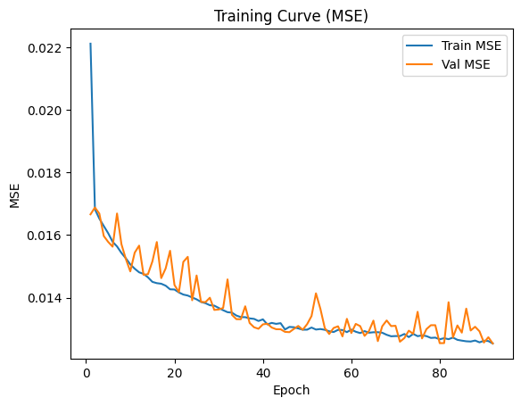
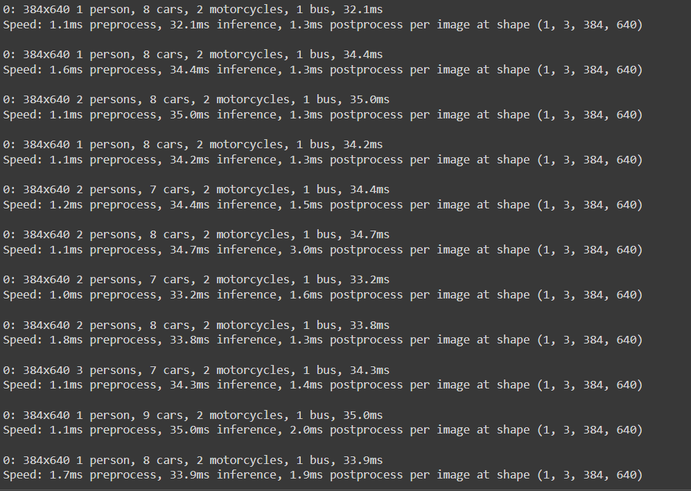

# Deep Neural Networks

Neural network and deep learning projects: a from-scratch MLP autopilot for a lunar lander game, a faster ByteTrack multi-object tracker, sound-based search and rescue classification, and CNN study scripts.

## Overview

This repository collects coursework and project work in neural networks and deep learning. The main item is the CE889 Neural Networks and Deep Learning final assignment (University of Essex), where a multilayer perceptron written in plain Python (no ML framework) learns to predict lander thrust and turn commands from the lander's X and Y distance to the landing pad. The repository also contains a team project on speeding up the ByteTrack multi-object tracker, a signals and systems project on detecting people under rubble from sound, and a set of computer vision study scripts.

## Contents

| Path | Description |
| --- | --- |
| `NeuralNetHolder.py`, `GameLoop.py` | CE889 lander: inference-only MLP loader and the game loop's "Neural Net" mode, which combines NN predictions with PD-style vertical and horizontal control |
| `nn_assignment.py`, `nn_assignment_latest_min.py` | MLP training pipeline in pure Python: cleaning, 70/15/15 split, min-max scaling, sigmoid MLP with momentum, early stopping, optional grid search, weight export to JSON |
| `class_balance_and_smote.py` | Discretises thrust/turn into 6 actions (Idle, Up, Left, Right, Up+Left, Up+Right), reports class balance and logistic regression F1, optional dependency-free SMOTE oversampling |
| `ce889_dataCollection.csv`, `train.csv`, `val.csv`, `test.csv` | Collected gameplay data and the processed splits (`x_dist, y_dist, thrust, turn`) |
| `Final_Assignment_Task_1.zip` | Full CE889 game project (pygame lander framework provided by the module, plus `data_preprocessing.py`, `training.py` and trained weights) |
| `Demonstration_Presentation.pdf` | Assignment presentation: data processing, network design, training and performance metrics |
| `*.png` (root) | Training curves (MSE, RMSE), grid search heatmaps, class distribution, confusion matrix and F1 plots |
| `bytetrack_with_hungarian_matching_enhanced_kalman/` | Team project: ByteTrack variants with Hungarian and Delaunay matching, Kalman filter variants and an Ensemble Random Forest filter, with input clips, result videos, report and presentation |
| `detecting_human_sound_localizing_people/` | Signals and Systems project (MKT2812): FFT/PSD analysis and MFCC-based CNN/LSTM classification of human, ambulance, fire truck and traffic sounds, with WAV inputs and report |
| `computer_vision/` | Study scripts: CNN basics on Fashion MNIST and sample images, MNIST classifier, Keras image classification |
| `pytorch/` | Notes (screenshots) on building a CNN in PyTorch |

## Tech stack

- Python (standard library MLP), pygame
- NumPy, pandas, scikit-learn, Matplotlib
- TensorFlow / Keras, librosa, SciPy
- YOLOv8 (ultralytics), ByteTrack, Roboflow supervision, OpenCV, lap, cython_bbox

## How to run

**CE889 lander game** (inside the archive):

```bash
unzip Final_Assignment_Task_1.zip
cd Final_Assignment_Task_1
pip install -r requirements.txt   # pygame
python data_preprocessing.py      # normalises ce889_dataCollection.csv into train/val/test and writes scale.txt
python training.py                # trains the 2-12-2 sigmoid MLP
python Main.py                    # starts the game (Play Game, Data Collection, Neural Net modes)
```

**Class balance report and SMOTE** (repository root):

```bash
python class_balance_and_smote.py --train train.csv --val val.csv --smote
```

**ByteTrack project:** `bytetrack_with_hungarian_matching_enhanced_kalman/ReadMe.txt` gives a step-by-step Google Colab procedure (YOLOv8 detection, original ByteTrack, then the modified tracker from [simaygoktug/mot](https://github.com/simaygoktug/mot)).

## Results

- **CE889 MLP:** the run recorded in `Performance Metrics.png` (2-8-2 network, learning rate 0.05, momentum 0.9, 100 epochs, 6848 training samples) reports test MSE 0.012336 and RMSE 0.111070.

  

- **ByteTrack:** the project report (`Final Project Report.pdf`) states that the Hungarian matching algorithm with the modified Kalman filter gave the best results. On a single `road_traffic_clip` frame, postprocessing time dropped from 928.0 ms to 2.7 ms with the same detections, and the report states a speed gain of almost 100% averaged over the test data without a large loss in tracking and counting accuracy.

  

## Author

Goktug Can Simay: [GitHub](https://github.com/simaygoktug) | [Website](https://goktugcansimay.com)

The ByteTrack project was carried out with Ali Dogan and Emre Emin Osman, and the sound localisation project with Ali Dogan. The lander game framework in the CE889 archive was provided by the module (Lewis Veryard and Hugo Leon-Garza).
